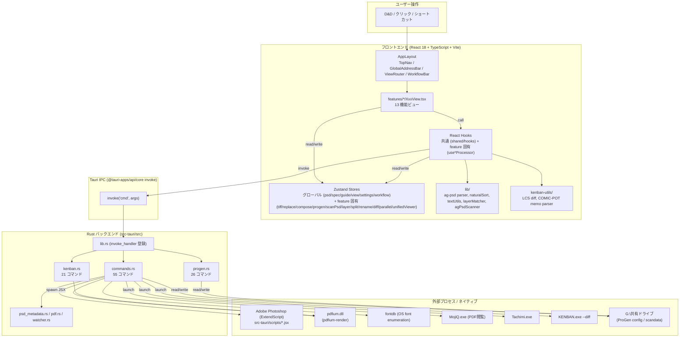
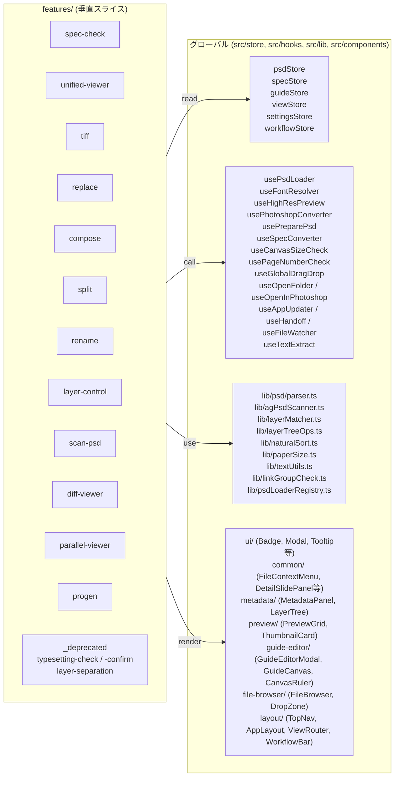
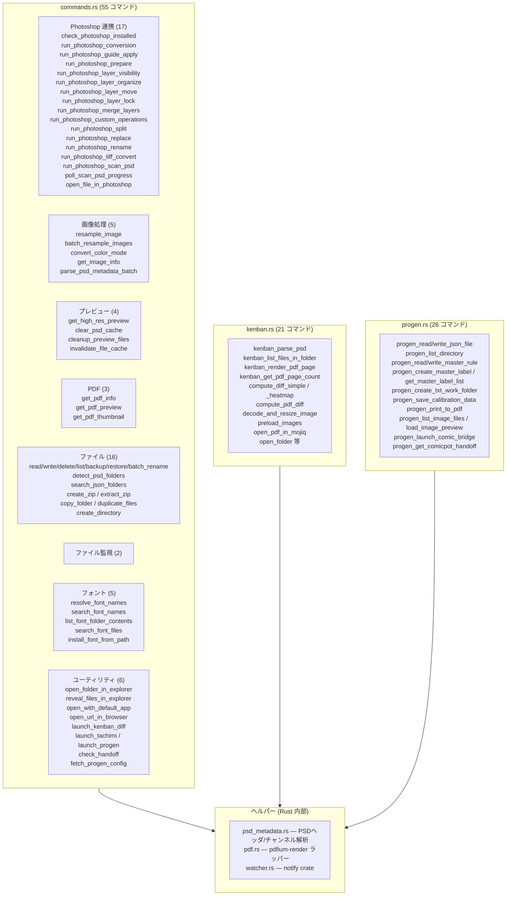
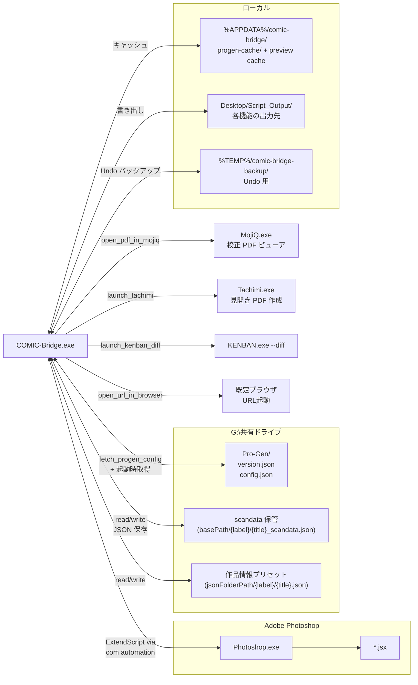

# アーキテクチャ全体図

COMIC-Bridge 統合版 のレイヤー構成と、各レイヤーが担う責務・代表的な呼び出し経路を俯瞰するドキュメント。

> 索引: [feature-map.md](feature-map.md) — 21機能 × 画面 × ストア対応表 / [data-flow.md](data-flow.md) — 代表シナリオのシーケンス図。

---

## 1. レイヤー構成（バードアイビュー）



### 各レイヤーの責務

| レイヤー | 責務 | 主なファイル |
|---|---|---|
| AppLayout | 画面の枠組み・グローバル D&D・WF 表示切替・ダークモード反転管理 | [shared/components/layout/](../src/components/layout/) |
| ViewRouter | [AppView](../src/store/viewStore.ts) 型に応じた画面の条件レンダリング・状態保持型マウント (progen / unifiedViewer) | [ViewRouter.tsx](../src/components/layout/ViewRouter.tsx) |
| Feature View | 機能タブのルート。各 feature のパネル/ドロップゾーン/ダイアログを組み立てる | `src/features/*/*View.tsx` |
| Zustand Store | ファイル・仕様・ガイド・UI状態・各機能の設定を保持。一部 localStorage 永続化 | `src/store/`, `src/features/*/*Store.ts` |
| Hook (Processor) | Store 読み書き + invoke + JSX 実行 + 結果マージ。副作用の集約点 | `src/features/*/use*Processor.ts`, `src/hooks/` |
| Rust commands | PSD 解析・画像処理・PDF レンダリング・PS 起動・ファイル操作・KENBAN/ProGen 専用処理 | [src-tauri/src/commands.rs](../src-tauri/src/commands.rs) 他 |
| Photoshop JSX | 破壊的画像処理（変換/差替え/分割/TIFF化/リネーム等）を Photoshop 上で実行 | [src-tauri/scripts/](../src-tauri/scripts/) |

---

## 2. なぜこの分離なのか（設計思想）

> **「検出はアプリ、修正は Photoshop」**

| 境界 | 理由 |
|---|---|
| React ⇄ Rust | 重い画像処理・ファイル I/O・外部プロセス起動を OS ネイティブで高速実行。`@tauri-apps/api/core` の `invoke` で型付き RPC。 |
| Rust ⇄ Photoshop | **ag-psd の `writePsd()` は PSD バイナリを破壊する**。書き込みを伴う処理は必ず Photoshop JSX 経由。メタデータ読み取りは ag-psd / psd crate で高速に。 |
| features/ ⇄ shared/ | feature 間の直接参照を禁止し、横断コードは `@shared/*` alias 経由で参照。将来の機能削除・入替えに強い構造。|

---

## 3. フロントエンド詳細（features 垂直スライス）



### グローバルストアとフィーチャーストアの住み分け

| 層 | ストア | 保持するもの | 永続化 |
|---|---|---|---|
| グローバル | [psdStore](../src/store/psdStore.ts) | files / selectedFileIds / activeFileId / viewMode / refreshCounter | — |
| グローバル | [specStore](../src/store/specStore.ts) | specifications / checkResults / autoCheckEnabled / conversionSettings | localStorage |
| グローバル | [guideStore](../src/store/guideStore.ts) | guides / history / future / selectedGuideIndex | — |
| グローバル | [viewStore](../src/store/viewStore.ts) | activeView (AppView) / progenMode / kenbanPathA/B | — |
| グローバル | [settingsStore](../src/store/settingsStore.ts) | 文字サイズ / ダークモード / ナビ・ツール配置 | localStorage |
| グローバル | [workflowStore](../src/store/workflowStore.ts) | activeWorkflow / currentStep / WORKFLOWS 定数 | — |
| feature | `features/*/*Store.ts` | 各機能ごとの設定・進行・結果 | 機能により一部 localStorage |

ルール: **feature 固有の状態は feature 内に閉じ込める。他 feature から読む必要があるものだけグローバルに昇格させる。**

---

## 4. Rust バックエンドの役割分担（102 コマンド）



---

## 5. Photoshop JSX カタログ

`src-tauri/scripts/` 配下の ExtendScript ファイル。対応する Rust コマンドがそれぞれを `settings_json` 等の引数付きで起動する。

| JSX | 対応 Rust コマンド | 主な feature |
|---|---|---|
| [apply_guides.jsx](../src-tauri/scripts/apply_guides.jsx) | `run_photoshop_guide_apply` | guide-editor / spec-check |
| [convert_psd.jsx](../src-tauri/scripts/convert_psd.jsx) | `run_photoshop_conversion` | spec-check (NG変換) |
| [prepare_psd.jsx](../src-tauri/scripts/prepare_psd.jsx) | `run_photoshop_prepare` | spec-check (統合処理) |
| [hide_layers.jsx](../src-tauri/scripts/hide_layers.jsx) | `run_photoshop_layer_visibility` | layer-control |
| [organize_layers.jsx](../src-tauri/scripts/organize_layers.jsx) | `run_photoshop_layer_organize` | layer-control |
| [move_layers.jsx](../src-tauri/scripts/move_layers.jsx) | `run_photoshop_layer_move` | layer-control |
| [custom_operations.jsx](../src-tauri/scripts/custom_operations.jsx) | `run_photoshop_custom_operations` | layer-control |
| [lock_layers.jsx](../src-tauri/scripts/lock_layers.jsx) | `run_photoshop_layer_lock` | layer-control |
| [merge_layers.jsx](../src-tauri/scripts/merge_layers.jsx) | `run_photoshop_merge_layers` | layer-control |
| [replace_layers.jsx](../src-tauri/scripts/replace_layers.jsx) | `run_photoshop_replace` | replace / compose |
| [split_psd.jsx](../src-tauri/scripts/split_psd.jsx) | `run_photoshop_split` | split |
| [rename_psd.jsx](../src-tauri/scripts/rename_psd.jsx) | `run_photoshop_rename` | rename (レイヤー) |
| [tiff_convert.jsx](../src-tauri/scripts/tiff_convert.jsx) | `run_photoshop_tiff_convert` | tiff |
| [scan_psd.jsx](../src-tauri/scripts/scan_psd.jsx) / [scan_psd_core.jsx](../src-tauri/scripts/scan_psd_core.jsx) | `run_photoshop_scan_psd` / `poll_scan_psd_progress` | scan-psd |

---

## 6. 外部プロセス・共有リソース連携



### 共有ドライブ依存に関する注意

- **ProGen 外部設定同期** は CLAUDE.md §28 で「試運転中」と明記されている未検証機能。切断時・JSON 破損時は埋め込み既定値で継続する三段フォールバック（[progenConfig.ts](../src/lib/progenConfig.ts)）。
- **scandata / 作品情報 JSON** の保管先パスは [scanPsdStore](../src/features/scan-psd/scanPsdStore.ts) の `jsonFolderPath` / `saveDataBasePath` / `textLogFolderPath` で localStorage 永続化。

---

## 7. 起動シーケンス（アプリ初期化）

```mermaid
sequenceDiagram
    autonumber
    participant M as main.tsx
    participant A as App.tsx
    participant L as AppLayout
    participant S as Zustand stores
    participant R as Rust (Tauri)
    participant U as useAppUpdater
    participant G as G:\共有ドライブ

    M->>A: render &lt;App /&gt;
    A->>S: 各 store の persist hydrate
    A->>A: initProgenConfig() 非同期開始
    A->>G: fetch_progen_config (Rust)
    G-->>A: version.json / config.json
    A->>A: Proxy 経由で ngWordList / numberSubRules を差替え
    A->>L: render AppLayout
    L->>L: useGlobalDragDrop() 開始
    L->>U: useAppUpdater() — 2秒後に更新確認
    U->>R: check / download / install
    L->>L: ViewRouter → specCheck を初期表示
    Note over L,S: 以降、ユーザー操作で各 feature をマウント
```

---

## 8. import 規約とパスエイリアス

[tsconfig.json](../tsconfig.json) と [vite.config.ts](../vite.config.ts) に同期設定済み:

```jsonc
"paths": {
  "@features/*": ["src/features/*"],
  "@shared/*":   ["src/shared/*"]
}
```

**現状**: `src/shared/` はまだスキャフォールド（空ディレクトリ）段階。実体は `src/components/`, `src/hooks/`, `src/lib/`, `src/store/`, `src/types/` に残っている。今後段階的に `@shared/*` 配下へ移動予定。詳細は [src/shared/README.md](../src/shared/README.md) を参照。

**禁止事項**: feature 間で直接 import しない（`@features/compose/...` を `@features/tiff/` から import しない）。共有が必要なコードは `@shared/*` へ昇格させる。

---

## 関連ドキュメント

- [feature-map.md](feature-map.md) — 21機能 × 画面 × ストア対応表
- [data-flow.md](data-flow.md) — 代表シナリオのデータフロー図
- [../CLAUDE.md](../CLAUDE.md) — 機能仕様・UI 詳細・Rust コマンド全一覧
- [../KENBAN統合手順書.md](../KENBAN統合手順書.md) — KENBAN 機能統合時の作業手順
