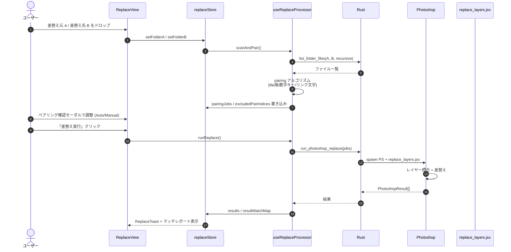
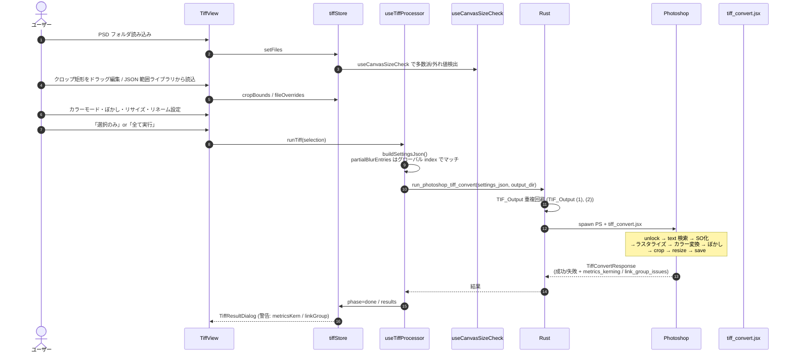
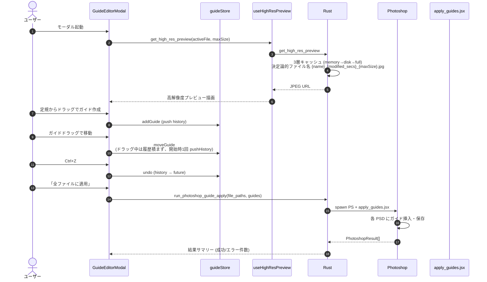
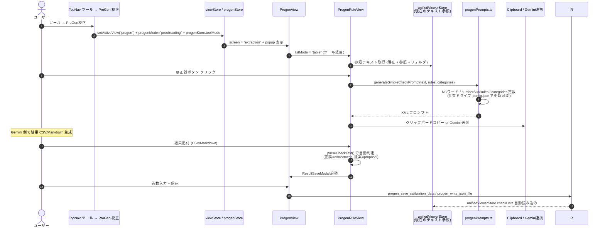
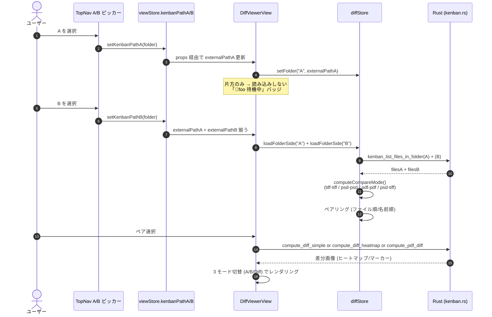
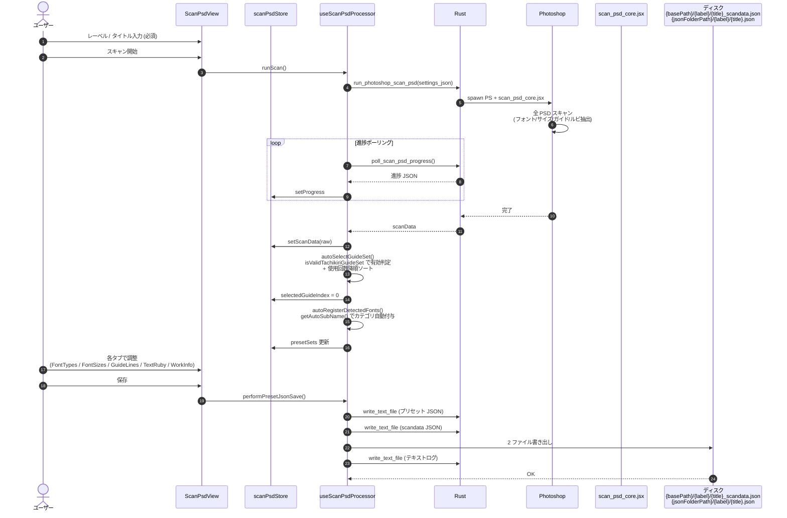
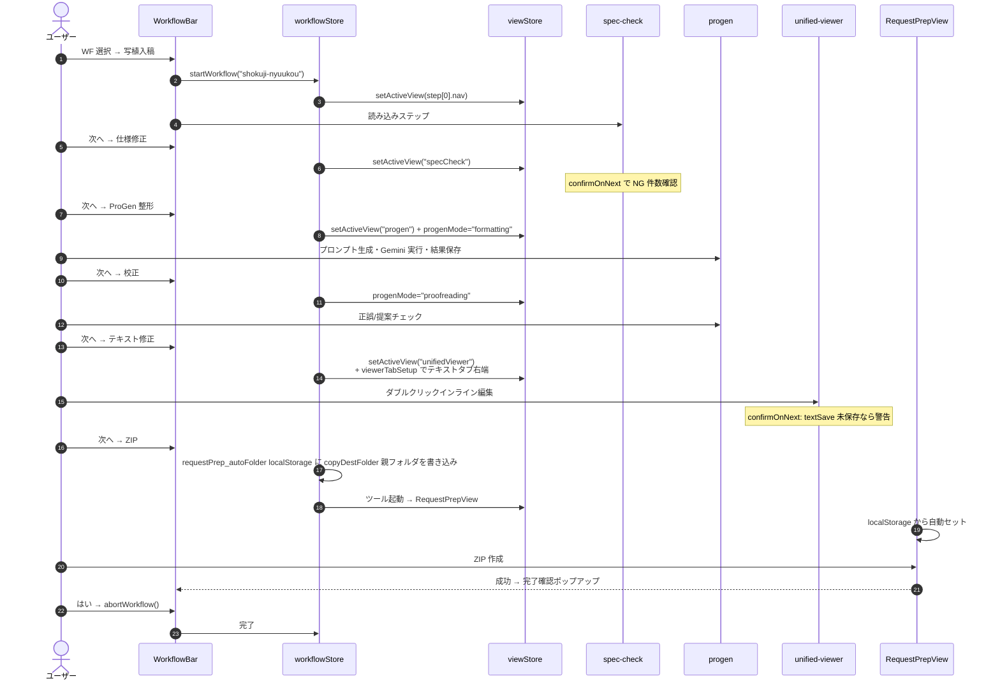

# データフロー

COMIC-Bridge 統合版 における代表的なユーザーシナリオのデータフロー。「何を操作するとどの層で何が起きるか」を順序立てて可視化する。

> 索引: [architecture.md](architecture.md) — レイヤー構成 / [feature-map.md](feature-map.md) — 機能対応表。

---

## 0. 共通: ファイル読み込み → 仕様チェック → NG 修正（ホーム画面の基本フロー）

```mermaid
sequenceDiagram
    autonumber
    actor U as ユーザー
    participant DZ as DropZone / TopNav
    participant PL as usePsdLoader
    participant PS as psdStore
    participant SC as useSpecChecker
    participant SS as specStore
    participant R as Rust
    participant AG as ag-psd
    participant MODAL as SpecSelectionModal
    participant PSAPP as Photoshop
    participant JSX as convert_psd.jsx / prepare_psd.jsx

    U->>DZ: フォルダ D&amp;D
    DZ->>PL: loadFolder(path)
    PL->>R: parse_psd_metadata_batch(filePaths)
    R->>AG: PSD header read
    AG-->>R: metadata
    R-->>PL: Vec&lt;PsdParseResult&gt;
    PL->>PS: addFiles(results)

    PS-->>MODAL: autoCheckEnabled ? 自動 : モーダル表示
    U->>MODAL: モノクロ/カラー選択
    MODAL->>SS: setCurrentSpec
    SS->>SC: checkAllFiles(specifications)
    SC->>PS: files から metadata 取得
    SC->>SS: checkResults 書き込み

    Note over U,SS: NG ファイル選択 → DetailSlidePanel で FixGuidePanel 表示

    U->>U: 「この1件を変換」クリック
    U->>JSX: usePhotoshopConverter or usePreparePsd
    JSX->>R: run_photoshop_conversion (or _prepare)
    R->>PSAPP: spawn PS + JSX
    PSAPP->>PSAPP: DPI/ColorMode/BitDepth 変換
    PSAPP-->>R: Vec&lt;PhotoshopResult&gt;
    R-->>JSX: 結果
    JSX->>R: parse_psd_metadata_batch(変換後)
    R-->>PS: updateFile で metadata 差替え
    SC->>SC: checkAllFiles を自動再実行
    SS-->>U: OK/NG 再表示
```

### 関連コード

- [usePsdLoader.ts](../src/hooks/usePsdLoader.ts) — 読み込み・自然順ソート・PDF 展開
- [useSpecChecker.ts](../src/features/spec-check/useSpecChecker.ts) — 仕様チェック（自動実行）
- [usePhotoshopConverter.ts](../src/hooks/usePhotoshopConverter.ts) — NG 変換
- [usePreparePsd.ts](../src/hooks/usePreparePsd.ts) — 統合処理（仕様修正 + ガイド適用を 1 回の PS パスで）
- [convert_psd.jsx](../src-tauri/scripts/convert_psd.jsx) / [prepare_psd.jsx](../src-tauri/scripts/prepare_psd.jsx)

### 重要な設計判断

- **ag-psd の `writePsd()` は使わない**: バイナリ破壊のリスクがあるため、書き込みは必ず Photoshop JSX 経由。
- **変換後は parse_psd_metadata_batch で再読み込み**: メモリ上の metadata を破棄し、ディスクから確実に最新を反映。
- **仕様チェックは自動再実行**: 100ms sleep 後に `checkAllFiles(specifications)` を呼ぶことで store 更新が確実に伝播。

---

## 1. レイヤー差替え（Replace）



### 関連コード
[ReplaceView.tsx](../src/features/replace/ReplaceView.tsx) / [replaceStore.ts](../src/features/replace/replaceStore.ts) / [useReplaceProcessor.ts](../src/features/replace/useReplaceProcessor.ts) / [replace_layers.jsx](../src-tauri/scripts/replace_layers.jsx)

### ポイント
- **ペアリング方式 4 種**: ファイル順 / 数字キー / リンク文字（自動検出）/ 手動マッチ
- **バッチモード**: 親フォルダ配下のサブフォルダを一括スキャンし、白消し・棒消しフォルダを自動検出
- **出力先**: `Desktop/Script_Output/差替えファイル_出力/{timestamp}/` (またはカスタム名)

---

## 2. TIFF 化（tiff）



### 関連コード
[TiffView.tsx](../src/features/tiff/TiffView.tsx) / [tiffStore.ts](../src/features/tiff/tiffStore.ts) / [useTiffProcessor.ts](../src/features/tiff/useTiffProcessor.ts) / [tiff_convert.jsx](../src-tauri/scripts/tiff_convert.jsx)

### ポイント
- **2 大プリフライト**: メトリクスカーニング検出 + リンクグループフォントサイズ検証（CLAUDE.md §27）
- **個別クロップ優先表示**: `fileOverrides[file.id].crop` が存在すればグローバル設定に優先
- **部分ぼかしのページマッチング**: 選択ファイルのみ処理でも `allPsdFiles` からグローバルページ番号を算出
- **出力形式**: TIFF (LZW) / JPG 選択可

---

## 3. ガイド線編集 → 一括適用



### 関連コード
[GuideEditorModal.tsx](../src/components/guide-editor/GuideEditorModal.tsx) / [guideStore.ts](../src/store/guideStore.ts) / [apply_guides.jsx](../src-tauri/scripts/apply_guides.jsx) / [useHighResPreview.ts](../src/hooks/useHighResPreview.ts)

### ポイント
- **3 層キャッシュ**: メモリ Map → ディスク JPEG → 未生成なら Rust でフル生成
- **Undo の粒度**: ドラッグ開始時のみ 1 回 `pushHistory`。ドラッグ中の連続イベントで履歴を汚さない
- **ショートカット**: ↑↓←→ 1px / +Shift 10px / Ctrl+Z/Y/Shift+Z

---

## 4. ProGen プロンプト生成（校正モード）



### 関連コード
[ProgenView.tsx](../src/features/progen/ProgenView.tsx) / [progenStore.ts](../src/features/progen/progenStore.ts) / [progenPrompts.ts](../src/features/progen/progenPrompts.ts) / [progenConfig.ts](../src/features/progen/progenConfig.ts) / [useProgenTauri.ts](../src/features/progen/useProgenTauri.ts)

### ポイント
- **Proxy 経由の動的参照**: `ngWordList` / `numberSubRules` / `categories` を Proxy でラップし、共有ドライブから取得した値を既存コード変更なしで反映
- **フォールバック 3 段**: リモート同期済みキャッシュ → 既存ローカルキャッシュ → 埋め込み既定値
- **保存後の自動読み込み**: `unifiedViewerStore.checkData` にセットされ、校正 JSON タブで即座に閲覧可能

---

## 5. 差分ビューアー（A/B 両方揃った時のみ読み込み）



### 関連コード
[DiffViewerView.tsx](../src/features/diff-viewer/DiffViewerView.tsx) / [diffStore.ts](../src/features/diff-viewer/diffStore.ts) / [TopNav.tsx](../src/components/layout/TopNav.tsx)

### ポイント（CLAUDE.md §30）
- **登録と読み込みを分離**: `setFolder` は片方でも即反映、`loadFolderSide` は両方揃った時のみ
- **TopNav の自動遷移は削除**: A/B 登録後にユーザーの明示操作でビューアーへ移動
- **不適切な組合せ判定**: `isValidPairCombination()` で compareMode に合わない場合は A 単独表示

---

## 6. スキャン PSD → プリセット JSON 保存（フォント帳連携）



### 関連コード
[ScanPsdView.tsx](../src/features/scan-psd/ScanPsdView.tsx) / [scanPsdStore.ts](../src/features/scan-psd/scanPsdStore.ts) / [useScanPsdProcessor.ts](../src/features/scan-psd/useScanPsdProcessor.ts) / [scan_psd_core.jsx](../src-tauri/scripts/scan_psd_core.jsx)

### ポイント
- **3 ファイル分離**: プリセット JSON (軽量・人間編集用) / scandata (完全データ・アプリ編集用) / テキストログ (ルビ等)
- **自動選択ロジック**: 有効タチキリガイドセット優先 → 使用回数降順 → index 0
- **ガード**: レーベル/タイトル未入力でのスキャン禁止、未入力時は `{basePath}/_仮保存/temp.json` に退避

---

## 7. ワークフロー（写植入稿）横断フロー



### 関連コード
[workflowStore.ts](../src/store/workflowStore.ts) / [WorkflowBar.tsx](../src/components/layout/WorkflowBar.tsx) / [RequestPrepView.tsx](../src/components/views/RequestPrepView.tsx)

### ポイント
- **自動ナビゲーション**: ステップ定義の `nav` / `progenMode` / `viewerTabSetup` で画面遷移
- **進行確認ダイアログ**: 各ステップに `confirmOnNext` (specCheck / textSave / wfComplete / textDiffThenExtract) を定義
- **localStorage バケツリレー**: `requestPrep_autoFolder` / `folderSetup_progenMode` / `progen_wfCheckMode` 等で feature 間の状態を引き渡し

---

## 8. データ格納先マップ

どこに何が保存されるか一覧。

```mermaid
flowchart TB
    subgraph LS["localStorage (永続化)"]
        LS1[specStore<br/>specifications / autoCheckEnabled / conversionSettings]
        LS2[settingsStore<br/>文字サイズ / ダークモード / ナビ配置]
        LS3[tiffStore<br/>settings (crop.bounds を除く)]
        LS4[scanPsdStore<br/>jsonFolderPath / saveDataBasePath / textLogFolderPath]
        LS5["WorkflowBar 連携<br/>requestPrep_autoFolder<br/>folderSetup_progenMode<br/>progen_wfCheckMode"]
    end

    subgraph APP["%APPDATA%/comic-bridge/"]
        APP1[progen-cache/<br/>共有ドライブ config の同期キャッシュ]
        APP2[preview cache/<br/>manga_psd_preview_*.jpg<br/>manga_pdf_preview_*.jpg]
    end

    subgraph TMP["%TEMP%/"]
        TMP1[comic-bridge-backup/<br/>ファイル操作 Undo 用]
    end

    subgraph DESK["Desktop/Script_Output/"]
        D1[差替えファイル_出力/{timestamp}/]
        D2[合成ファイル_出力/{timestamp}/]
        D3[分割ファイル_出力/...]
        D4[TIF_Output/ or TIF_Output (N)/]
        D5[レイヤー制御/{元フォルダ名}/]
        D6[テキスト抽出/{フォルダ名}.txt]
        D7[ZIP 出力先]
    end

    subgraph G["G:\共有ドライブ"]
        G1[Pro-Gen/<br/>version.json + config.json]
        G2[作品情報プリセット JSON<br/>{jsonFolderPath}/{label}/{title}.json]
        G3[scandata<br/>{saveDataBasePath}/{label}/{title}_scandata.json]
        G4[テキストログ<br/>{textLogFolderPath}/]
        G5[統一表記表 / NGワード表<br/>(RequestPrepView が参照)]
    end

    subgraph MEM["メモリ (Zustand — 永続化なし)"]
        M1[psdStore — ファイル一覧/選択]
        M2[guideStore — ガイド状態+Undo 履歴]
        M3[viewStore — activeView / kenbanPathA/B]
        M4[workflowStore — 進行状態]
        M5[progenStore / replaceStore / composeStore<br/>splitStore / renameStore / layerStore<br/>diffStore / parallelStore / unifiedViewerStore]
    end
```

---

## 関連ドキュメント

- [architecture.md](architecture.md) — レイヤー構成全体図
- [feature-map.md](feature-map.md) — 21機能 × 画面 × ストア対応表
- [../CLAUDE.md](../CLAUDE.md) — 機能仕様・Rust コマンド・UI 詳細
- [../KENBAN統合手順書.md](../KENBAN統合手順書.md) — KENBAN 機能統合時の手順
