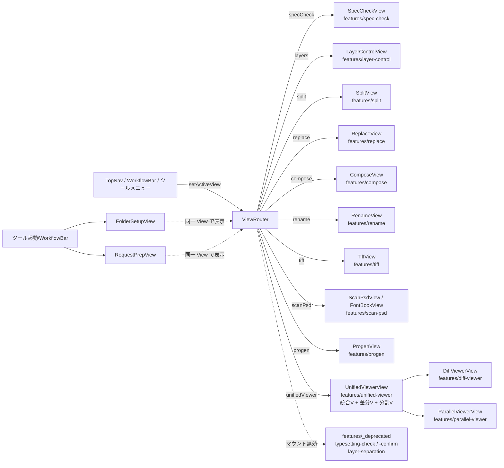

# 機能マップ

COMIC-Bridge 統合版 の全機能を「画面 × ストア × フック × Rust コマンド × Photoshop JSX」で横断整理したドキュメント。

> 索引: [architecture.md](architecture.md) — レイヤー構成全体図 / [data-flow.md](data-flow.md) — 代表シナリオのシーケンス。

---

## 1. 画面（AppView）と feature の対応

[viewStore.ts](../src/store/viewStore.ts) の `AppView` 型がタブ切替の source of truth。



> `FolderSetupView` / `RequestPrepView` は `src/components/views/` に残置されたツール系ビュー。ツールメニュー・WorkflowBar から起動され、viewStore を介さずモーダル的に表示される。

---

## 2. feature × ストア × フック × Rust × JSX 対応表

### 2.1 Photoshop を介す機能

| feature | 画面ファイル | 固有ストア | 中核フック | Rust コマンド | JSX |
|---|---|---|---|---|---|
| spec-check (変換) | [SpecCheckView.tsx](../src/features/spec-check/SpecCheckView.tsx) | — | [useSpecChecker.ts](../src/features/spec-check/useSpecChecker.ts), [usePhotoshopConverter.ts](../src/hooks/usePhotoshopConverter.ts), [usePreparePsd.ts](../src/hooks/usePreparePsd.ts), [useSpecConverter.ts](../src/hooks/useSpecConverter.ts) | `run_photoshop_conversion`, `run_photoshop_prepare`, `run_photoshop_guide_apply`, `resample_image`, `convert_color_mode` | [convert_psd.jsx](../src-tauri/scripts/convert_psd.jsx), [prepare_psd.jsx](../src-tauri/scripts/prepare_psd.jsx), [apply_guides.jsx](../src-tauri/scripts/apply_guides.jsx) |
| layer-control | [LayerControlView.tsx](../src/features/layer-control/LayerControlView.tsx) | [layerStore.ts](../src/features/layer-control/layerStore.ts) | [useLayerControl.ts](../src/features/layer-control/useLayerControl.ts) | `run_photoshop_layer_visibility` / `_organize` / `_move` / `_lock` / `_merge` / `_custom_operations` | [hide_layers.jsx](../src-tauri/scripts/hide_layers.jsx), [organize_layers.jsx](../src-tauri/scripts/organize_layers.jsx), [move_layers.jsx](../src-tauri/scripts/move_layers.jsx), [lock_layers.jsx](../src-tauri/scripts/lock_layers.jsx), [merge_layers.jsx](../src-tauri/scripts/merge_layers.jsx), [custom_operations.jsx](../src-tauri/scripts/custom_operations.jsx) |
| replace | [ReplaceView.tsx](../src/features/replace/ReplaceView.tsx) | [replaceStore.ts](../src/features/replace/replaceStore.ts) | [useReplaceProcessor.ts](../src/features/replace/useReplaceProcessor.ts) | `run_photoshop_replace` | [replace_layers.jsx](../src-tauri/scripts/replace_layers.jsx) |
| compose | [ComposeView.tsx](../src/features/compose/ComposeView.tsx) | [composeStore.ts](../src/features/compose/composeStore.ts) | [useComposeProcessor.ts](../src/features/compose/useComposeProcessor.ts) | `run_photoshop_replace` (compose mode) | [replace_layers.jsx](../src-tauri/scripts/replace_layers.jsx) |
| split | [SplitView.tsx](../src/features/split/SplitView.tsx) | [splitStore.ts](../src/features/split/splitStore.ts) | [useSplitProcessor.ts](../src/features/split/useSplitProcessor.ts) | `run_photoshop_split` | [split_psd.jsx](../src-tauri/scripts/split_psd.jsx) |
| rename (レイヤー) | [RenameView.tsx](../src/features/rename/RenameView.tsx) | [renameStore.ts](../src/features/rename/renameStore.ts) | [useRenameProcessor.ts](../src/features/rename/useRenameProcessor.ts) | `run_photoshop_rename` | [rename_psd.jsx](../src-tauri/scripts/rename_psd.jsx) |
| tiff | [TiffView.tsx](../src/features/tiff/TiffView.tsx) | [tiffStore.ts](../src/features/tiff/tiffStore.ts) | [useTiffProcessor.ts](../src/features/tiff/useTiffProcessor.ts), [useCropEditorKeyboard.ts](../src/features/tiff/useCropEditorKeyboard.ts) | `run_photoshop_tiff_convert` | [tiff_convert.jsx](../src-tauri/scripts/tiff_convert.jsx) |
| scan-psd | [ScanPsdView.tsx](../src/features/scan-psd/ScanPsdView.tsx), [FontBookView.tsx](../src/features/scan-psd/FontBookView.tsx) | [scanPsdStore.ts](../src/features/scan-psd/scanPsdStore.ts), [fontBookStore.ts](../src/features/scan-psd/fontBookStore.ts) | [useScanPsdProcessor.ts](../src/features/scan-psd/useScanPsdProcessor.ts) | `run_photoshop_scan_psd`, `poll_scan_psd_progress`, `resolve_font_names`, `search_font_names`, `install_font_from_path` | [scan_psd.jsx](../src-tauri/scripts/scan_psd.jsx), [scan_psd_core.jsx](../src-tauri/scripts/scan_psd_core.jsx) |

### 2.2 Photoshop 不要 / 閲覧系

| feature | 画面ファイル | 固有ストア | 中核フック | Rust コマンド |
|---|---|---|---|---|
| unified-viewer | [UnifiedViewerView.tsx](../src/features/unified-viewer/UnifiedViewerView.tsx) | [unifiedViewerStore.ts](../src/features/unified-viewer/unifiedViewerStore.ts) | [useViewerFileOps.ts](../src/features/unified-viewer/components/useViewerFileOps.ts) | `get_high_res_preview`, `get_pdf_preview`, `read_text_file`, `write_text_file` |
| diff-viewer | [DiffViewerView.tsx](../src/features/diff-viewer/DiffViewerView.tsx) | [diffStore.ts](../src/features/diff-viewer/diffStore.ts) | — (store + kenban コマンド直接) | `kenban_parse_psd`, `kenban_list_files_in_folder`, `kenban_render_pdf_page`, `compute_diff_simple`, `compute_diff_heatmap`, `compute_pdf_diff`, `decode_and_resize_image`, `preload_images` |
| parallel-viewer | [ParallelViewerView.tsx](../src/features/parallel-viewer/ParallelViewerView.tsx) | [parallelStore.ts](../src/features/parallel-viewer/parallelStore.ts) | — | `kenban_parse_psd`, `kenban_list_files_in_folder`, `kenban_render_pdf_page`, `kenban_get_pdf_page_count`, `decode_and_resize_image` |
| progen | [ProgenView.tsx](../src/features/progen/ProgenView.tsx) | [progenStore.ts](../src/features/progen/progenStore.ts) | [useProgenTauri.ts](../src/features/progen/useProgenTauri.ts), [useProgenJson.ts](../src/features/progen/useProgenJson.ts), [useComicPotState.ts](../src/features/progen/useComicPotState.ts) | `progen_*` 26 コマンド（JSON 読書・マスタールール管理・TXT フォルダ・校正データ保存 等） |

### 2.3 テキスト抽出・ユーティリティ（グローバルフック、View を持たない）

| 機能 | 配置 | 呼び出し元 | 備考 |
|---|---|---|---|
| テキスト抽出 (COMIC-POT 出力) | [useTextExtract.ts](../src/hooks/useTextExtract.ts) + [TextExtractButton.tsx](../src/components/common/TextExtractButton.tsx) | spec-check 右下 / layer-control 右下 / typesetting 系右下 | ag-psd の layerTree から抽出、Photoshop 不要 |
| キャンバスサイズ検証 | [useCanvasSizeCheck.ts](../src/hooks/useCanvasSizeCheck.ts) | spec-check, tiff | 多数派検出 + `outlierFileIds` |
| ページ番号検証 | [usePageNumberCheck.ts](../src/hooks/usePageNumberCheck.ts) | spec-check, rename | 連続数字抽出 + 欠番検出 |
| アプリ更新 | [useAppUpdater.ts](../src/hooks/useAppUpdater.ts) | AppLayout (起動時) | Tauri Updater プラグイン |
| ハンドオフ | [useHandoff.ts](../src/hooks/useHandoff.ts) | App.tsx 起動時 | `check_handoff` → 他ツールからの引き渡し受け取り |
| ファイル変更監視 | [useFileWatcher.ts](../src/hooks/useFileWatcher.ts) | AppLayout | `start_file_watcher` → psdStore 再読み込み |

### 2.4 _deprecated (隔離中)

| 機能 | 配置 | 状態 |
|---|---|---|
| 写植チェック (typesettingCheck) | [src/features/_deprecated/typesetting/check/](../src/features/_deprecated/typesetting/) | ViewRouter でマウント無効。統合ビューアー「校正JSON」タブで代替 |
| 写植確認 (typesettingConfirm) | [src/features/_deprecated/typesetting/confirm/](../src/features/_deprecated/typesetting/) | マウント無効。統合ビューアーテキストタブ + フォント割当UI で代替 |
| レイヤー分離 (layerSeparation) | [src/features/_deprecated/layer-separation/](../src/features/_deprecated/layer-separation/) | ドットメニューから除外 |

---

## 3. グローバルストア × feature の依存マトリクス

各 feature がグローバルストアのどれを読み書きしているか。

| feature / ストア | psdStore | specStore | guideStore | viewStore | settingsStore | workflowStore |
|---|:-:|:-:|:-:|:-:|:-:|:-:|
| spec-check | R/W | R/W | R/W | R | R | R |
| layer-control | R/W | R | — | R | R | R |
| replace | R | — | — | R | R | R |
| compose | R | — | — | R | R | R |
| split | R/W | — | — | R | R | R |
| rename | R/W | — | — | R | R | — |
| tiff | R | R | R | R | R | R |
| scan-psd | R | R | R | R | R | R |
| unified-viewer | R (doSync) | R | — | R | R | R |
| diff-viewer | — | — | — | R/W (kenbanPathA/B) | R | — |
| parallel-viewer | — | — | — | R/W (kenbanPathA/B) | R | — |
| progen | — | — | — | R (progenMode) | R | — |

**R/W**: 読み書き、**R**: 読み取りのみ、**—**: 関与なし

### 観察される特性

1. **psdStore が中心**: 7 機能が R/W。ここがファイル状態の single source of truth。
2. **specStore は spec-check 専有 + 読み取り参照のみ**: tiff/scan-psd が仕様設定を参照するが変更はしない。
3. **viewStore.kenbanPathA/B の共有**: TopNav A/B ピッカー ⇄ diff-viewer ⇄ parallel-viewer の 3 箇所で双方向同期（CLAUDE.md §30 の A/B 共有要件）。
4. **workflowStore はほぼ読み取り専用**: WF 起動中はすべての feature がステップ定義を参照して自動遷移する。書き込みは WorkflowBar のみ。

---

## 4. 機能間連携（依頼準備〜ZIP 出力の横断例）

```mermaid
flowchart LR
    subgraph WF["WorkflowBar (写植入稿)"]
        W1[読み込み]
        W2[仕様修正]
        W3[ProGen整形]
        W4[校正]
        W5[テキスト修正]
        W6[ZIP]
    end

    W1 -->|psdStore.loadFolder| SC[spec-check]
    W2 -->|usePreparePsd| SC
    W3 -->|setActiveView progen<br/>+ progenMode| PG[progen]
    W4 -->|校正モード PU| PG
    W5 -->|統合ビューアー text tab| UV[unified-viewer]
    W6 -->|requestPrep_autoFolder| RQ[RequestPrepView]

    SC -.psdStore.-> UV
    PG -.unifiedViewerStore.textContent.-> UV
    UV -.Desktop/Script_Output.-> RQ
    RQ -->|create_zip| Desktop[(Desktop/ZIP)]
```

他のワークフロー:
- **初校確認**: ProofLoadOverlay → spec-check → unified-viewer (テキスト照合) → 提案チェック → Tachimi → ZIP 外部校正
- **校正確認**: 校正確認 → 赤字修正 → MojiQ → 編集確認
- **白消しTIFF**: replace → diff-viewer → tiff → diff-viewer → tiff 格納

詳細は [CLAUDE.md §23 ワークフローナビゲーション](../CLAUDE.md#23-ワークフローナビゲーションv365-大幅刷新) を参照。

---

## 5. 数字で見る規模

| 項目 | 数 | 備考 |
|---|---:|---|
| AppView タブ | 11 | specCheck / layers / split / replace / compose / rename / tiff / scanPsd / typesetting (無効) / progen / unifiedViewer |
| feature ディレクトリ | 13 + 1 | 実機能 13 + _deprecated 1 |
| グローバル Zustand ストア | 6 | psd / spec / guide / view / settings / workflow |
| feature 固有ストア | 13 | tiff / replace / compose / split / rename / scanPsd / fontBook / layer / progen / diff / parallel / unifiedViewer / typesettingCheck (deprecated) |
| 主要フック | 35+ | グローバル 15 + feature 固有 20+ |
| Rust コマンド | 102 | commands.rs 55 + kenban.rs 21 + progen.rs 26 |
| Photoshop JSX | 15 | `src-tauri/scripts/` |
| ワークフロー | 4 | 写植入稿 / 初校確認 / 校正確認 / 白消しTIFF |

---

## 関連ドキュメント

- [architecture.md](architecture.md) — レイヤー構成全体図
- [data-flow.md](data-flow.md) — 代表シナリオのシーケンス図
- [../CLAUDE.md](../CLAUDE.md) — 機能仕様詳細・UI・Rust コマンド全一覧
- 各 feature の README — [spec-check](../src/features/spec-check/README.md), [tiff](../src/features/tiff/README.md), [progen](../src/features/progen/README.md), [compose](../src/features/compose/README.md), [replace](../src/features/replace/README.md), [layer-control](../src/features/layer-control/README.md), [split](../src/features/split/README.md), [rename](../src/features/rename/README.md), [scan-psd](../src/features/scan-psd/README.md), [unified-viewer](../src/features/unified-viewer/README.md), [diff-viewer](../src/features/diff-viewer/README.md), [parallel-viewer](../src/features/parallel-viewer/README.md)
